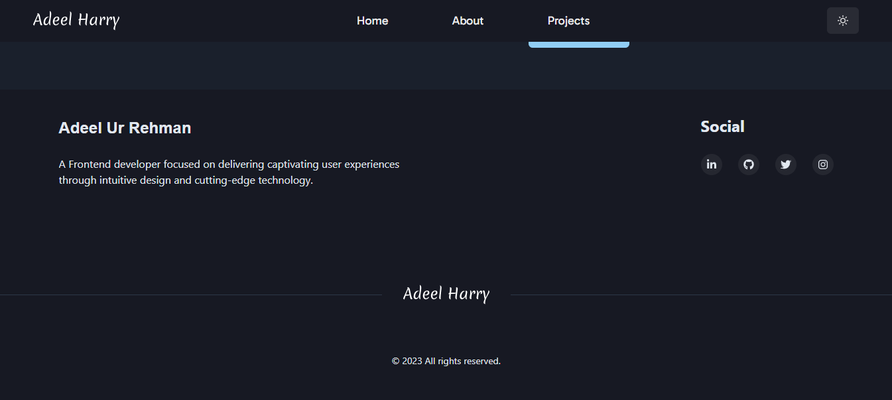

# My Personal Portfolio Website

Welcome to the repository for my personal portfolio website! This website showcases my skills, projects, and experiences as a web developer. 
It is still under progress and i will be adding more. 

## Table of Contents

- [About](#about)
- [Technologies Used](#technologies-used)
- [Features](#features)
- [Installation](#installation)
- [Usage](#usage)
- [Contributing](#contributing)
- [License](#license)

## About

This personal portfolio website serves as a central hub for anyone interested in learning more about me and my work as a web developer. It includes details about my education, skills, and showcases some of my notable projects.

## Technologies Used

- [Vite](https://vitejs.dev/) - Frontend build tool
- [TypeScript](https://www.typescriptlang.org/) - Programming language
- [React](https://reactjs.org/) - JavaScript library for building user interfaces
- [Chakra UI](https://chakra-ui.com/) - UI component library

## Features

- **Responsive Design:** The website is fully responsive and optimized for various devices.
- **Dark Mode:** Enjoy a comfortable browsing experience with both light and dark mode options.
- **Project Showcase:** Highlighting some of my best projects to date.
- **Contact Section:** Easily get in touch with me through provided contact information.

## Project Previews

Here are some screenshots from my portfolio website:


*HomePage*


*About Page*


*Project Section*


*Footer*


## Installation

If someone wants to check out your code and run the project locally, provide instructions on how to do so.

```bash
# Clone the repository
git clone https://github.com/AHarry7/Personal-Portfolio.git

# Navigate to the project directory
cd Personal-Portfolio

# Install dependencies
npm install

# Start the development server
npm run dev   

